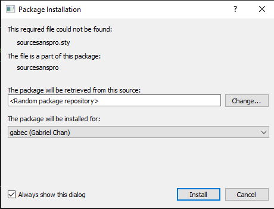

Key items for setup:

1) install a VS Code TeX extension to make it easier to edit - note some cause errors!
2) install TeX Distribution like MiKTeX Console - ensure you update all the packages so you can compile the file
3) Install the true type fonts in windows (select all, right click and install) - otherwise they will be missing when you compile the pdf
   1) if you try to copy the files, you'll have to ensure you check where the fonts directories being viewed are setup under the font .conf file
4) move the files from examples to the main/root directory, e.g resume.tex, including .png files otherwise you will get a /begin error
5) during the compile, you may get some request to install additional libaries
6) ERROR

(C:\Users\gabec\AppData\Local\Programs\MiKTeX\tex/latex/rerunfilecheck\rerunfil
echeck.sty
(C:\Users\gabec\AppData\Local\Programs\MiKTeX\tex/latex/base\atveryend-ltx.sty)

(C:\Users\gabec\AppData\Local\Programs\MiKTeX\tex/generic/uniquecounter\uniquec
ounter.sty)))

! LaTeX cmd Error: Command '\FA' already defined!

For immediate help type H `<return>`.
...

l.166 \newfontfamily
\headerfont[
? H

You have used \NewDocumentCommand with a command that already has a
definition.

The existing definition of '\FA' will not be altered.

--------Modified Code ------------

% Set the FontAwesome font to be up-to-date.
\newfontfamily\**FAWE**[Path=\@fontdir]{FontAwesome}
% Set font for header (defaul

changed from \FA to \FAWE
